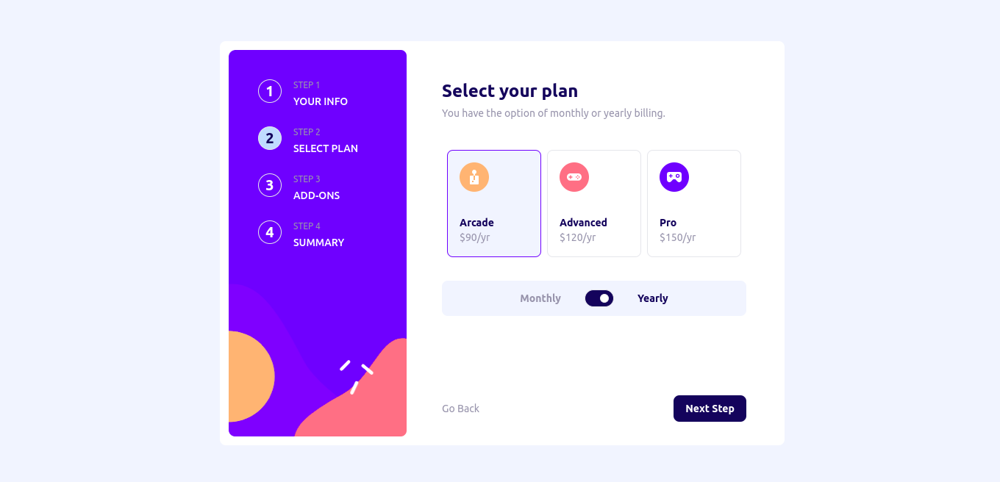

# Frontend Mentor - Multi-step form

## Table of contents

- [The challenge](#the-challenge)
- [Solution Screenshot](#solution-screenshot)
- [Links](#links)
- [My process](#my-process)
  - [Built with](#built-with)
  - [What I learned](#what-i-learned)
  - [Continued development](#continued-development)
- [Author](#author)
- [Acknowledgments](#acknowledgments)

## The challenge

Your challenge is to build out this multi-step sign up form and get it looking as close to the design as possible.

You can use any tools you like to help you complete the challenge. So if you've got something you'd like to practice, feel free to give it a go.

Your users should be able to:

- Complete each step of the sequence
Go back to a previous step to update their selections

- See a summary of their selections on the final step and confirm their order

- View the optimal layout for the interface depending on their device's screen size

- See hover and focus states for all interactive elements on the page

- Receive form validation messages if:
  - A field has been missed
  - The email address is not formatted correctly
  - A step is submitted, but no selection has been made

## Solution Screenshot

## Links

-   Solution URL: [https://github.com/coderSuresh/multi-step-form](https://github.com/coderSuresh/multi-step-form)
-   Live Site URL: [https://multi-step-form-pi-five.vercel.app/](https://multi-step-form-pi-five.vercel.app/)

## My process

### Built with

- Nextjs
- Tailwindcss
- Typescript

### What I learned

I learned to make a multi-step form with Nextjs and Tailwindcss. I also learned to use the context api to manage the state of the form.

### Continued development

I want to continue to learn more about the context api and how to use it to manage the state of the form.

## Author

-   Github - [@coderSuresh](https://github.com/coderSuresh)
-   Frontend Mentor - [@coderSuresh](https://www.frontendmentor.io/profile/codersuresh)
-   Linkedin - [@coderSuresh](https://www.linkedin.com/in/codersuresh)

## Acknowledgments

I want to thank Frontend Mentor for providing me with this challenge.